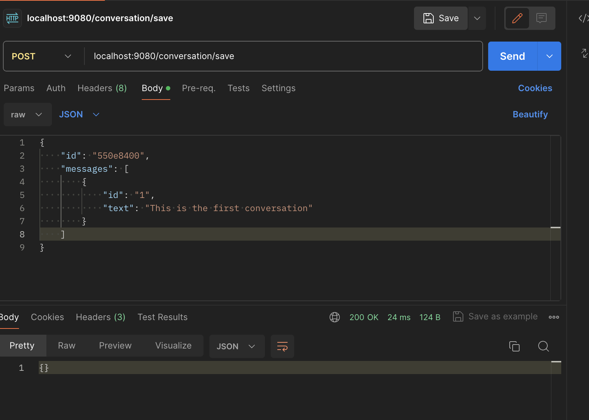
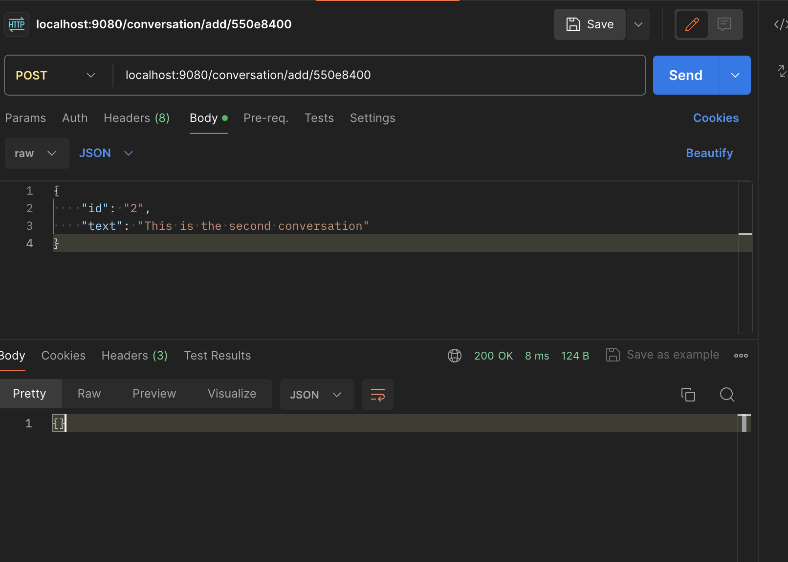
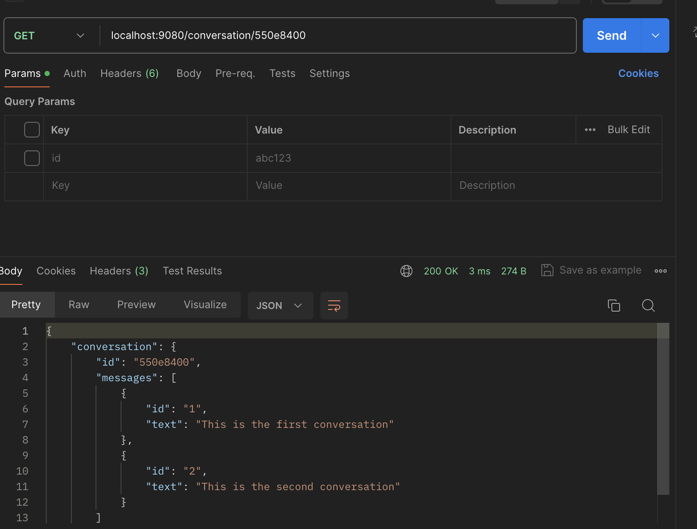

# meli-backend
Prueba de backend para meli implementando un gestor de conversaciones para los LLM

### Instalacion de MongoDB con docker

``` sh
docker run --name some-mongo -p 27017:27017 -d mongo
```

### Instalaccion de dependencias
```sh
go get ./...
```

### Ejecutar la app
```sh
go run .
```

## Endpoints:
```sh
POST   /conversations/save
POST   /conversations/add/:id
GET    /conversations/:id
```

## Save conversation


## Add message


## Get conversation
